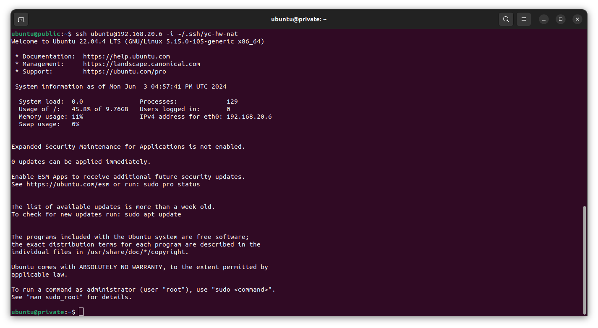

# Никоноров Денис - FOPS-8
# Домашнее задание к занятию «Организация сети»

---
### Задание 1. Yandex Cloud 

**Что нужно сделать**

1. Создать пустую VPC. Выбрать зону.
2. Публичная подсеть.

 - Создать в VPC subnet с названием public, сетью 192.168.10.0/24.
 - Создать в этой подсети NAT-инстанс, присвоив ему адрес 192.168.10.254. В качестве image_id использовать fd80mrhj8fl2oe87o4e1.
 - Создать в этой публичной подсети виртуалку с публичным IP, подключиться к ней и убедиться, что есть доступ к интернету.
3. Приватная подсеть.
 - Создать в VPC subnet с названием private, сетью 192.168.20.0/24.
 - Создать route table. Добавить статический маршрут, направляющий весь исходящий трафик private сети в NAT-инстанс.
 - Создать в этой приватной подсети виртуалку с внутренним IP, подключиться к ней через виртуалку, созданную ранее, и убедиться, что есть доступ к интернету.

Resource Terraform для Yandex Cloud:

- [VPC subnet](https://registry.terraform.io/providers/yandex-cloud/yandex/latest/docs/resources/vpc_subnet).
- [Route table](https://registry.terraform.io/providers/yandex-cloud/yandex/latest/docs/resources/vpc_route_table).
- [Compute Instance](https://registry.terraform.io/providers/yandex-cloud/yandex/latest/docs/resources/compute_instance).

---

### Решение задания 1. Yandex Cloud

Создан пустой VPC с именем `dvl` (develop):

```terraform
resource "yandex_vpc_network" "dvl" {
	name = var.vpc_name

variable "vpc_name" {
	type = string
	default = "dvl"
	description = "VPC network"
}

```

Создан в VPC публичную подсеть с названием public, сетью 192.168.10.0/24:

```terraform
resource "yandex_vpc_subnet" "public" {
  name           = var.public_subnet
  zone           = var.default_zone
  network_id     = yandex_vpc_network.dvl.id
  v4_cidr_blocks = var.public_cidr
}

variable "public_cidr" {
  type        = list(string)
  default     = ["192.168.10.0/24"]
  description = "https://cloud.yandex.ru/docs/vpc/operations/subnet-create"
}

variable "public_subnet" {
  type        = string
  default     = "public"
  description = "subnet name"
}
```
Ресурс и переменный посмотреть в файлах [network.tf](/network.tf) и [variables.tf](/variables.tf)

 - создан в публичной подсети NAT-instance, присвоенным ему адресом 192.168.10.254. В качестве image_id использован fd80mrhj8fl2oe87o4e1.

Листинг instance можно посмотреть в файле [nat_instance.tf](/nat_instance.tf)

 - Создана виртулька с публичным IP в публичной подсетке.

Листинг виртуалки в файле [public.tf](/public.tf)

Видим что все запустилось и получены ip адреса

Проверим сможем ли подключится к виртуалке 

Был сгенерирован ключ ed25519.

И подключение произведено с помощью ключа `-i`:


Сделаем попингуй 


Минутка поднятия настроения! =)


Видно пинг google идет. Значит сеть на виртуалке есть все работает.

Создан в VPC приватная подсетка с наванием private, 192.168.20.0/24:

```terraform
resource "yandex_vpc_subnet" "private" {
  name           = var.private_subnet
  zone           = var.default_zone
  network_id     = yandex_vpc_network.dvl.id
  v4_cidr_blocks = var.private_cidr
  route_table_id = yandex_vpc_route_table.private-route.id
}

variable "private_cidr" {
  type        = list(string)
  default     = ["192.168.20.0/24"]
  description = "https://cloud.yandex.ru/docs/vpc/operations/subnet-create"
}

variable "private_subnet" {
  type        = string
  default     = "private"
  description = "subnet name"
}
```

Все есть в файлах [network.tf](/network.tf) и [variables.tf](/variables.tf).

 - Создан route table и добавлен статический маршрут направляющий весь исходящий трафик private сетки в NAT-instance.

```terraform
resource "yandex_vpc_route_table" "private-route" {
  name       = "private-route"
  network_id = yandex_vpc_network.dvl.id
  static_route {
    destination_prefix = "0.0.0.0/0"
    next_hop_address   = "192.168.10.254"
  }
```
 - Создан в приватной подсетке виртуалка с внутренним IP, без внешнего.

Листинг виртуалки в файле [private.tf](/private.tf)

Что бы проверить доступность интернета в приватное ВМ и работы NAT-instance скопирован приватный ключ на публичную ВМ. Потом с публичной ВМ подключаемся к приватной по внутренненему IP:





Попингуй google проходит на приватной ВМ, сеть работает.

Теперь глянем а что будет если выключить NAT-instance.


Проверим пинг


А пинга то нет. Интернет не работает после выключения NAT-instance, статический маршрут направляющий весь исходящий трафик private сети в NAT-instance настроен правильно.

Проверка `yc compute instance list`


output terraform 

